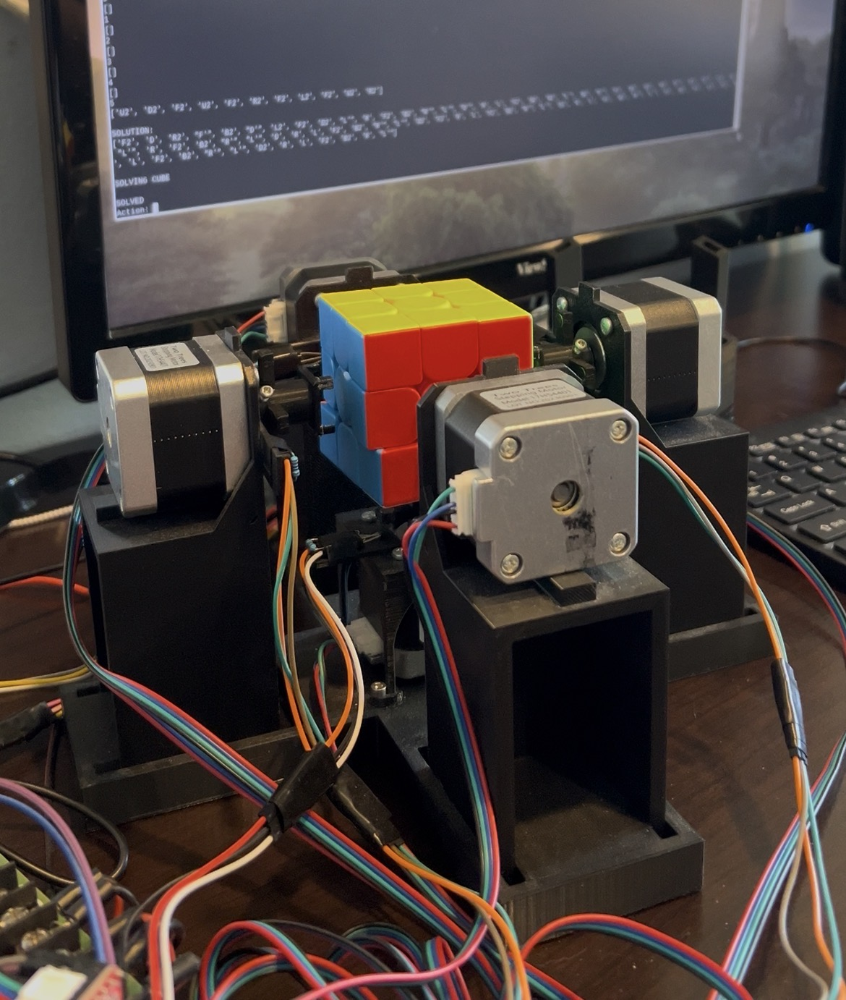

# rubiks-cube-solving-robot

Autonomous robot that scans a scrambled Rubik's Cube, computes a solution, and executes it mechanically. 

## Problem
Design an end-to-end system capable of quickly and reliably solving a Rubik's Cube, including vision-based state mapping, solution planning, and physical actuation under hardware constraints.

## Solution
A Raspberry Pi based system using camera input for color detection, a heuristic-guided solver to compute soltuion sequence, and stepper motor actuation to perform cube moves.

## Key Technical Details
- Statistical color classification using sample data and chi-square analysis
- Heuristic-driven depth-first search solver implemented in Python
- Stepper motors controled by A4988 drivers for precise and repeatable cube turns

## Results
- Accurate cube state mapping across varied environmental and cube conditions
- Successful autonomous solves from arbitrary scrambles
- 30 move average solution length
- 1 minute average solve time 

## Media

## Future Work
Optional, short
